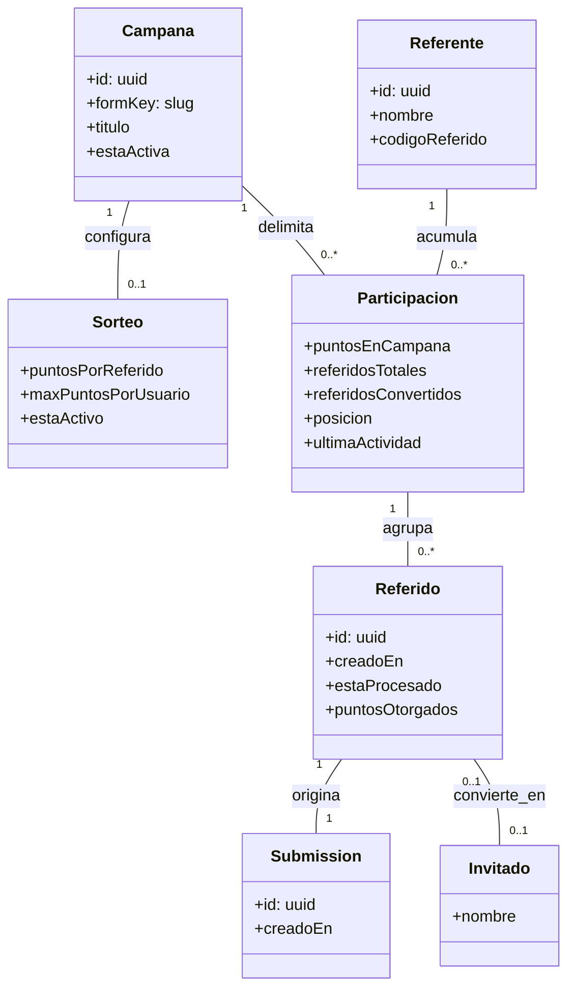
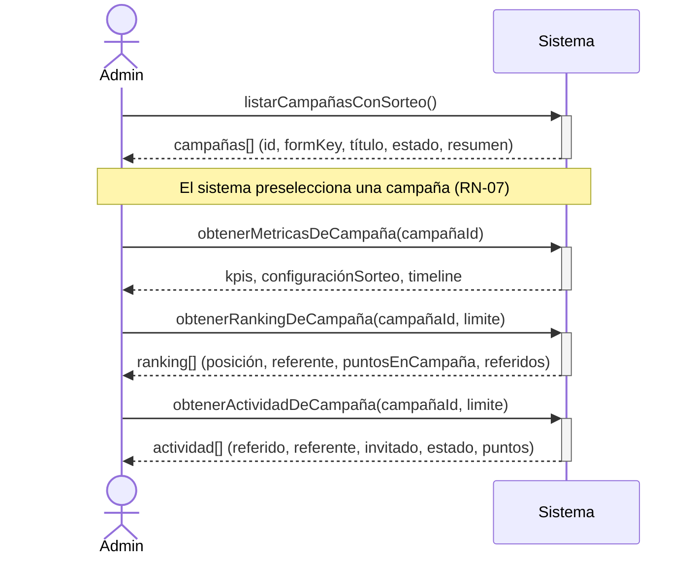
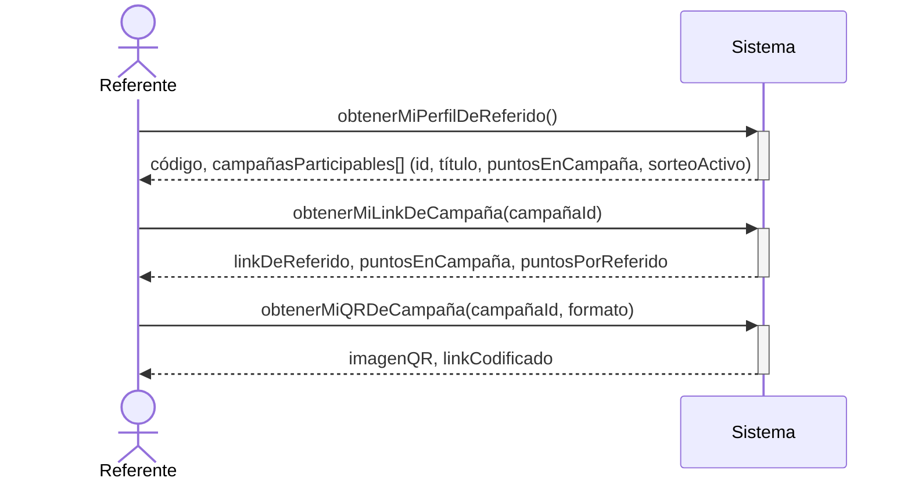
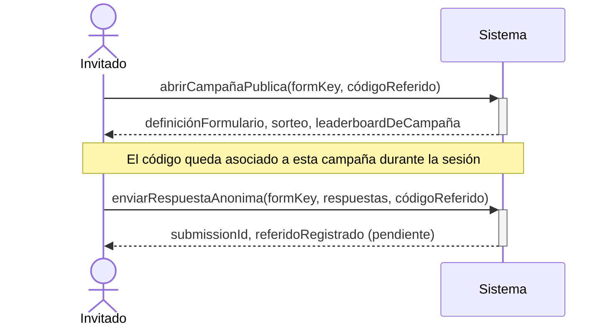
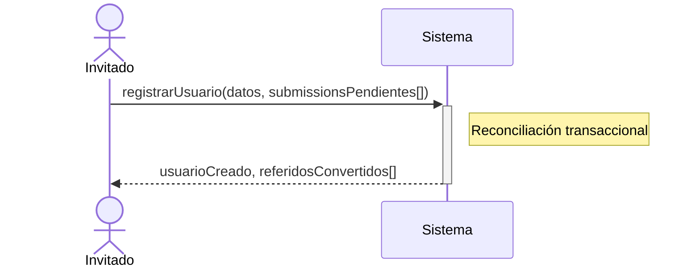
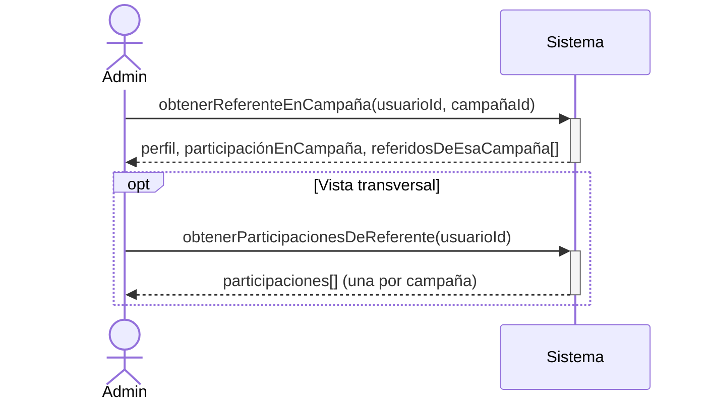
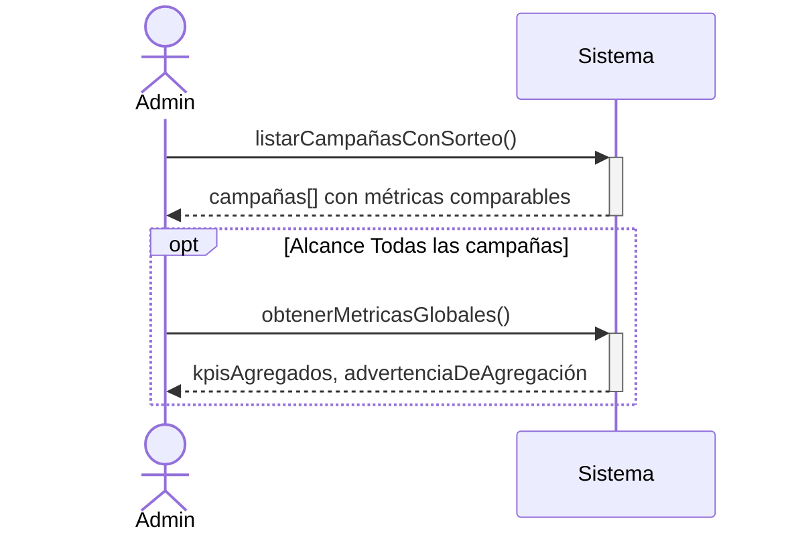

# Especificación — Sistema de Referidos por Campaña

**Ruta afectada:** `/referidos` (y `/referidos/*`)
**Metodología:** SSD (System Sequence Diagrams — Larman, *Applying UML and Patterns*)
**Estado:** Borrador para revisión
**Fecha:** 2026-07-27

Este documento especifica **qué debe hacer el sistema**, no cómo implementarlo. Cada operación de sistema identificada en un SSD tiene su **contrato de operación** (pre/postcondiciones) en la sección 8.

---

## Tabla de contenidos

1. [Propósito y alcance](#1-propósito-y-alcance)
2. [Estado actual verificado](#2-estado-actual-verificado)
3. [Enunciado del problema](#3-enunciado-del-problema)
4. [Glosario](#4-glosario)
5. [Modelo de dominio conceptual](#5-modelo-de-dominio-conceptual)
6. [Actores y objetivos](#6-actores-y-objetivos)
7. [Casos de uso](#7-casos-de-uso)
8. [Diagramas de secuencia de sistema (SSD) y contratos](#8-diagramas-de-secuencia-de-sistema-ssd-y-contratos)
9. [Delta de API requerido](#9-delta-de-api-requerido)
10. [Reglas de negocio](#10-reglas-de-negocio)
11. [Impacto en el frontend](#11-impacto-en-el-frontend)
12. [Criterios de aceptación](#12-criterios-de-aceptación)
13. [Decisiones abiertas](#13-decisiones-abiertas)
14. [Migración y riesgos](#14-migración-y-riesgos)

---

## 1. Propósito y alcance

### Objetivo

Reestructurar el sistema de referidos para que la **campaña sea la unidad de organización de primer nivel**. Hoy el módulo se comporta como si existiera una sola campaña: un único código, un único link, un único acumulado de puntos y un ranking global que mezcla campañas distintas.

### Dentro de alcance

- Panel administrativo `/referidos` reorganizado por campaña.
- Perfil del referente `/referidos/perfil` con desglose y links por campaña.
- Generación de link y QR **por campaña**.
- Ranking, actividad y KPIs **con alcance de campaña**.
- Contratos de API necesarios (delta sobre lo existente).

### Fuera de alcance

- Cambios al motor de puntos/ledger del backend (se asume que ya acumula por sorteo — ver §2).
- Premiación, sorteo del ganador y notificaciones.
- Rediseño visual del módulo más allá de lo que exige la reorganización.

---

## 2. Estado actual verificado

Levantado leyendo el código, no supuesto:

| Elemento | Archivo | Comportamiento actual |
|---|---|---|
| Rutas del módulo | `Aquanova/src/components/Referidos/Index.jsx:18-23` | `index`, `perfil`, `formulario/:formId`, `usuario/:userId` |
| KPIs del panel | `pages/ReferralDashboard.jsx:295-305` | **Globales**, agregados sobre todas las campañas |
| Tab "Ranking global" | `pages/ReferralDashboard.jsx:240` → `getRanking()` | **Global**, sin alcance de campaña |
| Tab "Actividad" | `pages/ReferralDashboard.jsx:242` → `getActivity()` | **Global**; la campaña aparece solo como texto secundario (`item.form_title`, línea 187) |
| Tab "Por formulario" | `pages/ReferralDashboard.jsx:241` → `getPerForm()` | Única vista con noción de campaña; es un tab de tercer nivel |
| Detalle de campaña | `pages/FormReferralDetail.jsx:30` → `getFormMetrics(formId)` | Correcto por campaña (config + timeline + top10) |
| Perfil del referente | `pages/ReferralProfilePage.jsx:263` → `getReferralProfile()` | **Global**: un `referral_code`, un `referral_url`, un `total_accumulated_points` |
| QR del referente | `pages/ReferralProfilePage.jsx:15` → `getReferralQR()` | Se invoca **sin `formId`**, aunque el servicio lo soporta (`referralService.js:30-33`) |
| Descarga PNG del QR | `pages/ReferralProfilePage.jsx:34` | `downloadQRPng(code)` — **sin `formId`** |

### Dos defectos concretos detectados de paso

**D-1 — El link de referido global no resuelve en este frontend.**
`FRONTEND_REFERIDOS_GUIDE.md` §2 documenta que el backend arma `{FRONTEND_URL}{REFERRAL_FORM_PATH}?ref=CODE` = `/formulario?ref=EAL34TM`. Pero la ruta pública declarada es `/formulario/:formKey` (`Aquanova/src/App.jsx:51`) y **no hay ruta catch-all `path='*'`** en `<Routes>`. Un link sin `formKey` no hace match con ninguna ruta y renderiza el área de contenido vacía.

**D-2 —`formId` (uuid) ≠ `formKey` (slug).**
El endpoint del QR recibe `?formId=<uuid>` (`referralService.js:31`), pero la ruta pública se resuelve por slug (`publicFormService.js:12-17`, `GET /forms/public/{formKey}`). Para armar un link válido por campaña hace falta el **slug**, no el uuid.

Ambos defectos desaparecen si el link se construye por campaña, que es justamente lo que pide esta especificación.

### Lo que el backend ya soporta

`REFERRAL_METRICS.md` §6 muestra que `GET /api/giveaways/metrics/user/:userId` ya devuelve un arreglo **`by_giveaway[]`** con `form_id`, `form_title`, `points_earned`, `referrals_in_giveaway`. **El ledger ya contabiliza por sorteo.** El problema es de exposición y de UI, no de modelo de datos.

---

## 3. Enunciado del problema

> En `/referidos`, el sistema de referidos debe ser **por campaña** y no basarse solo en las respuestas de una sola campaña.

Desglosado en necesidades verificables:

| # | Necesidad |
|---|---|
| N-1 | Un administrador debe poder **elegir la campaña** y ver KPIs, ranking y actividad **de esa campaña**. |
| N-2 | El ranking no debe mezclar puntos ganados en campañas distintas: competir en "Censo Las Mercedes" no debe alterar el puesto en "Censo San Rafael". |
| N-3 | Un referente debe obtener un **link y un QR distintos por cada campaña** en la que participa. |
| N-4 | El referente debe ver **cuántos puntos lleva en cada campaña**, no solo un total agregado. |
| N-5 | La vista global (todas las campañas) debe seguir existiendo, pero como **consulta secundaria**, no como la entrada por defecto. |
| N-6 | El sistema debe soportar **N campañas con sorteo activo simultáneamente**. |

---

## 4. Glosario

| Término | Definición |
|---|---|
| **Campaña** | Formulario de recolección publicado. En la UI se etiqueta "Campañas" (`Navbar.jsx:10` → `/forms`). En la API corresponde a un `form`. |
| **Sorteo (giveaway)** | Configuración de incentivos asociada a **una** campaña: `points_per_referral`, `max_points_per_user`, `is_active`. |
| **Referente** | Usuario autenticado que comparte su link/QR para invitar a responder una campaña. |
| **Invitado** | Persona anónima que abre el link de referido y responde el formulario. |
| **Código de referido** | Identificador corto y estable del referente (p. ej. `EAL34TM`). Es **identidad del referente**, no de la campaña. |
| **Link de referido de campaña** | URL que combina campaña + referente: `/formulario/{formKey}?ref={código}`. |
| **Referido** | Registro que vincula (referente, campaña, submission). Nace `is_processed=false`. |
| **Conversión** | Un referido pasa a `is_processed=true` cuando el invitado completa su registro y se le acreditan puntos al referente. |
| **Participación** | Relación (referente × campaña) con sus propios puntos, referidos y posición. **Concepto central de esta especificación.** |

---

## 5. Modelo de dominio conceptual



> `Campana` / `puntosEnCampana` se escriben sin `ñ` únicamente por compatibilidad del renderizador de diagramas; en el dominio y en la UI el término es **Campaña**.

**Invariante central:** *toda métrica de referidos se lee a través de `Participacion`, es decir, siempre con un par (referente, campaña).* Las cifras globales son una **agregación derivada** sobre `Participacion`, nunca la fuente de verdad.

---

## 6. Actores y objetivos

| Actor | Tipo | Objetivo |
|---|---|---|
| **Administrador** | Principal | Comparar el desempeño de referidos entre campañas y auditar una campaña concreta. |
| **Operador** | Principal | Consultar el estado de la(s) campaña(s) a su cargo. |
| **Referente** | Principal | Obtener su link/QR de una campaña y saber cuántos puntos lleva en ella. |
| **Invitado** | Principal | Responder la campaña a la que fue invitado. |
| **Visitante público** | Principal | Ver el leaderboard de la campaña desde el formulario público. |
| **Servicio de QR** | De soporte | Generar la imagen del código QR. |

Permisos vigentes en `Navbar.jsx:12` — `/referidos` está expuesto a `administrador`, `admin` y `operador`. `/referidos/perfil` es accesible a cualquier usuario autenticado.

---

## 7. Casos de uso

### Resumen (formato breve)

| ID | Caso de uso | Actor |
|---|---|---|
| CU-01 | Consultar panel de referidos por campaña | Administrador / Operador |
| CU-02 | Ver detalle de referidos de una campaña | Administrador / Operador |
| CU-03 | Comparar campañas entre sí | Administrador |
| CU-04 | Obtener link y QR de referido de una campaña | Referente |
| CU-05 | Consultar mi desempeño por campaña | Referente |
| CU-06 | Responder una campaña mediante link de referido | Invitado |
| CU-07 | Convertir un referido al registrarse | Invitado |
| CU-08 | Auditar a un referente dentro de una campaña | Administrador |

---

### CU-01 — Consultar panel de referidos por campaña *(formato extendido)*

| Campo | Contenido |
|---|---|
| **Actor principal** | Administrador / Operador |
| **Interesados** | Admin: necesita saber qué campaña rinde. Referentes: esperan un ranking justo por campaña. |
| **Precondiciones** | Usuario autenticado con rol `administrador`, `admin` u `operador`. |
| **Garantía de éxito** | Se muestran KPIs, ranking y actividad **acotados a la campaña seleccionada**. |
| **Disparador** | El usuario navega a `/referidos`. |

**Flujo principal**

1. El usuario abre `/referidos`.
2. El sistema presenta la **lista de campañas con sorteo**, cada una con sus cifras resumidas (referidos, conversión, puntos distribuidos, participantes) y su estado.
3. El sistema **preselecciona** una campaña según RN-07.
4. El usuario selecciona una campaña.
5. El sistema muestra los KPIs de esa campaña.
6. El usuario alterna entre las pestañas **Ranking**, **Actividad** y **Configuración del sorteo**; todas acotadas a la campaña seleccionada.
7. El usuario abre el perfil de un referente **en el contexto de esa campaña**.

**Extensiones**

- **2a. No existe ninguna campaña con sorteo configurado.** El sistema muestra un estado vacío con acción directa a crear/configurar un sorteo. Fin.
- **2b. Falla la carga del listado.** El sistema muestra el error y ofrece reintentar, conservando la selección previa si la hubiera.
- **4a. La campaña seleccionada no tiene actividad de referidos.** El sistema muestra los KPIs en cero y estados vacíos por pestaña; la campaña **sigue siendo seleccionable**.
- **6a. El usuario activa el alcance "Todas las campañas".** El sistema muestra las cifras agregadas y **marca explícitamente** que el ranking es una suma entre campañas (RN-05).

---

### CU-04 — Obtener link y QR de referido de una campaña *(formato extendido)*

| Campo | Contenido |
|---|---|
| **Actor principal** | Referente |
| **Precondiciones** | Usuario autenticado con código de referido asignado. |
| **Garantía de éxito** | El referente obtiene un link y un QR válidos que apuntan a **una campaña concreta**. |
| **Disparador** | El usuario navega a `/referidos/perfil`. |

**Flujo principal**

1. El usuario abre `/referidos/perfil`.
2. El sistema muestra su código de referido y la **lista de campañas con sorteo activo** en las que puede participar, con sus puntos acumulados en cada una.
3. El usuario selecciona una campaña.
4. El sistema devuelve el **link de esa campaña** (`/formulario/{formKey}?ref={código}`) y sus puntos en ella.
5. El usuario copia el link, lo comparte o solicita el QR.
6. El sistema genera el QR **de ese link de campaña**.
7. El usuario descarga el PNG o lo comparte.

**Extensiones**

- **2a. No hay campañas con sorteo activo.** El sistema informa que no hay campañas abiertas y **no ofrece link ni QR** (RN-04). Fin.
- **4a. La campaña no tiene `formKey` publicado.** El sistema no entrega link y reporta que la campaña no está publicada (previene D-1/D-2). Fin.
- **6a. Falla la generación del QR.** El sistema mantiene disponible el link copiable y reporta el fallo solo del QR.
- **7a. El navegador no soporta compartir nativo.** El sistema degrada a copiar al portapapeles.

---

## 8. Diagramas de secuencia de sistema (SSD) y contratos

Notación: el **Sistema** se trata como caja negra. Cada flecha entrante es una **operación de sistema**; cada operación tiene su contrato debajo.

---

### SSD-01 — CU-01 · Consultar panel por campaña



**Contrato CO-01 — `listarCampañasConSorteo()`**

- **Referencias:** CU-01, CU-03
- **Precondiciones:** actor autenticado con rol `administrador` | `admin` | `operador`.
- **Postcondiciones:**
  - Se devuelve una colección de campañas que tienen sorteo configurado (activo **o** inactivo).
  - Cada elemento expone: `form_id`, `form_key`, `form_title`, `is_active`, `points_per_referral`, `total_referrals`, `processed_referrals`, `pending_referrals`, `total_points_distributed`, `active_referrers`, `conversion_rate`.
  - La colección se ordena según RN-07.
  - No se modifica ningún estado del sistema.

**Contrato CO-02 — `obtenerMetricasDeCampaña(campañaId)`**

- **Precondiciones:** `campañaId` corresponde a una campaña existente con sorteo configurado; actor autorizado.
- **Postcondiciones:**
  - Se devuelven KPIs **calculados exclusivamente sobre `Participacion` de esa campaña**.
  - Se devuelve la configuración del sorteo y el `timeline` diario.
  - Si la campaña no tiene actividad, todos los contadores valen `0` y `timeline` es una colección vacía; **no es un error**.
  - Sin cambios de estado.

**Contrato CO-03 — `obtenerRankingDeCampaña(campañaId, limite)`**

- **Precondiciones:** las de CO-02; `limite` entero positivo (por defecto 50).
- **Postcondiciones:**
  - Se devuelven las participaciones de la campaña ordenadas por `puntosEnCampaña` descendente (desempate: RN-06).
  - `posicion` es **densa y contigua desde 1 dentro de la campaña**.
  - Los puntos obtenidos en otras campañas **no** influyen en el orden ni en el valor mostrado (RN-01).
  - Sin cambios de estado.

**Contrato CO-04 — `obtenerActividadDeCampaña(campañaId, limite)`**

- **Precondiciones:** las de CO-02.
- **Postcondiciones:**
  - Se devuelven los referidos de esa campaña, más recientes primero.
  - Cada elemento incluye estado (`is_processed`), puntos otorgados y el invitado cuando ya existe.
  - Sin cambios de estado.

---

### SSD-02 — CU-04 · Obtener link y QR de una campaña



**Contrato CO-05 — `obtenerMiPerfilDeReferido()`**

- **Precondiciones:** usuario autenticado.
- **Postcondiciones:**
  - Se devuelve el `referral_code` del usuario (único y estable — RN-02).
  - Se devuelve `campaigns[]`: **una entrada por campaña con sorteo**, con `points_in_campaign`, `referrals_in_campaign`, `position`, `is_active`.
  - Se devuelve `total_accumulated_points` como **suma derivada** de `campaigns[]`, marcada como agregado.
  - Si el usuario aún no tiene código, el sistema le asigna uno y lo devuelve *(único efecto de estado admitido en esta operación)*.

**Contrato CO-06 — `obtenerMiLinkDeCampaña(campañaId)`**

- **Precondiciones:** usuario autenticado; la campaña tiene sorteo **activo** y `form_key` publicado.
- **Postcondiciones:**
  - Se devuelve una URL absoluta con forma `{FRONTEND_URL}/formulario/{form_key}?ref={referral_code}`.
  - La URL resuelve contra la ruta pública real del frontend (`App.jsx:51`) — corrige **D-1**.
  - La URL se construye con el **slug** `form_key`, no con el uuid — corrige **D-2**.
  - Si el sorteo está inactivo o falta `form_key`, **no se devuelve link** y se reporta la causa.
  - Sin cambios de estado.

**Contrato CO-07 — `obtenerMiQRDeCampaña(campañaId, formato)`**

- **Precondiciones:** las de CO-06; `formato ∈ {dataurl, png, svg}`.
- **Postcondiciones:**
  - Se devuelve una imagen QR que codifica **exactamente** la URL de CO-06.
  - Dos campañas distintas del mismo referente producen **QR distintos**.
  - Sin cambios de estado.

---

### SSD-03 — CU-06 · Responder una campaña vía link de referido



**Contrato CO-08 — `abrirCampañaPublica(formKey, códigoReferido)`**

- **Precondiciones:** existe una campaña publicada con ese `formKey`.
- **Postcondiciones:**
  - Se devuelve la definición del formulario y, si hay sorteo, su configuración y leaderboard **de esa campaña**.
  - El `códigoReferido` queda asociado **al par (campaña, sesión)**, no a la sesión global (RN-03).
  - Si el código no existe o no participa en esa campaña, se ignora y el formulario se sirve igual (RN-08).
  - Sin cambios de estado persistente.

**Contrato CO-09 — `enviarRespuestaAnonima(formKey, respuestas, códigoReferido)`**

- **Precondiciones:** la campaña acepta respuestas; las respuestas pasan validación.
- **Postcondiciones:**
  - Se crea una `Submission` asociada a la campaña.
  - Si hay `códigoReferido` válido **para esa campaña**, se crea un `Referido` con `is_processed = false`, asociado al par (referente, campaña).
  - Si el código no es válido para esa campaña, la submission se crea **sin** referido (RN-08).
  - No se otorgan puntos todavía.

---

### SSD-04 — CU-07 · Conversión del referido al registrarse



**Contrato CO-10 — `registrarUsuario(datos, submissionsPendientes[])`**

- **Precondiciones:** los datos de registro son válidos; las submissions existen y no están vinculadas a otro usuario.
- **Postcondiciones (todas dentro de una misma transacción):**
  - Se crea el `Usuario` y se le asigna su propio `referral_code`.
  - Cada submission pendiente queda vinculada al nuevo usuario.
  - Por cada `Referido` asociado: pasa a `is_processed = true` y se acreditan puntos al referente **imputados a la campaña de esa submission** (RN-01).
  - Los puntos respetan `max_points_per_user` **por campaña** (RN-09).
  - La `Participacion` (referente, campaña) queda actualizada.
  - Si cualquier paso falla, **no se aplica ninguno** (atomicidad).

---

### SSD-05 — CU-08 · Auditar a un referente dentro de una campaña



**Contrato CO-11 — `obtenerReferenteEnCampaña(usuarioId, campañaId)`**

- **Precondiciones:** actor con rol `administrador` | `admin`; usuario y campaña existen.
- **Postcondiciones:**
  - Se devuelven los datos del referente y su `Participacion` **en esa campaña**.
  - `recent_referrals` contiene **solo** referidos de esa campaña.
  - `position` es la posición **dentro de esa campaña**.
  - Sin cambios de estado.

**Contrato CO-12 — `obtenerParticipacionesDeReferente(usuarioId)`**

- **Precondiciones:** las de CO-11.
- **Postcondiciones:**
  - Se devuelve una fila por campaña en la que el referente tiene participación.
  - El total agregado se marca explícitamente como derivado (RN-05).
  - Sin cambios de estado.

---

### SSD-06 — CU-03 · Comparar campañas *(alcance global explícito)*



**Contrato CO-13 — `obtenerMetricasGlobales()`**

- **Precondiciones:** actor autorizado.
- **Postcondiciones:**
  - Se devuelven cifras agregadas sobre todas las campañas.
  - La respuesta incluye una **marca de agregación** que el frontend debe mostrar (RN-05).
  - Se devuelve `campaigns_count` para que el consumidor sepa cuántas campañas se sumaron.
  - Sin cambios de estado.

---

## 9. Delta de API requerido

Base actual: `/api/giveaways/*` y `/api/users/me/*`.

### Endpoints nuevos

| Método | Ruta | Contrato | Sustituye a |
|---|---|---|---|
| `GET` | `/api/giveaways/campaigns` | CO-01 | `/metrics/per-form` (promovido a entrada principal) |
| `GET` | `/api/giveaways/:formId/ranking?limit=` | CO-03 | — *(hoy solo existe ranking global)* |
| `GET` | `/api/giveaways/:formId/activity?limit=` | CO-04 | — *(hoy solo existe actividad global)* |
| `GET` | `/api/users/me/referral-link?formId=` | CO-06 | — *(hoy el link viene global en el perfil)* |

### Endpoints a extender

| Método | Ruta | Cambio |
|---|---|---|
| `GET` | `/api/users/me/referral-profile` | Añadir `campaigns[]` con `points_in_campaign`, `referrals_in_campaign`, `position`, `is_active`, `form_key`. Marcar `total_accumulated_points` como derivado. |
| `GET` | `/api/users/me/referral-qr` | Hacer `formId` **obligatorio**; construir la URL con `form_key`. Corrige D-1 y D-2. |
| `GET` | `/api/giveaways/metrics/user/:userId` | Aceptar `?formId=` opcional para acotar `recent_referrals` y `position` a una campaña (CO-11). |
| `GET` | `/api/giveaways/metrics/overview` | Añadir `is_aggregate: true` y `campaigns_count` (CO-13). |

### Endpoints sin cambios

`GET /api/giveaways/:formId/metrics` (CO-02) y `GET /api/giveaways/:formId/leaderboard` (público) ya son correctos por campaña.

### Forma de respuesta propuesta — `GET /api/users/me/referral-profile`

```json
{
  "ok": true,
  "data": {
    "referral_code": "EAL34TM",
    "total_accumulated_points": 45,
    "is_aggregate": true,
    "campaigns": [
      {
        "form_id": "uuid-...",
        "form_key": "censo-las-mercedes-2026",
        "form_title": "Censo de Usuarios Las Mercedes",
        "is_active": true,
        "points_per_referral": 10,
        "points_in_campaign": 30,
        "referrals_in_campaign": 3,
        "successful_in_campaign": 3,
        "position": 2,
        "referral_url": "https://aquavisor.co/formulario/censo-las-mercedes-2026?ref=EAL34TM"
      }
    ]
  }
}
```

> `referral_url` se entrega **por campaña**. No debe existir un `referral_url` a nivel raíz: es precisamente el campo que produce D-1.

---

## 10. Reglas de negocio

| ID | Regla |
|---|---|
| **RN-01** | Los puntos se imputan siempre a la campaña de la submission que originó el referido. Un punto pertenece a exactamente una campaña. |
| **RN-02** | El `referral_code` identifica al **referente**, es único y estable, y **no** se duplica por campaña. El alcance de campaña lo aporta el `formKey` del link. |
| **RN-03** | El código de referido capturado se asocia al par (campaña, sesión). Abrir la campaña B con un link no debe atribuir su respuesta al referente del link de la campaña A. |
| **RN-04** | Solo se generan link y QR para campañas con sorteo **activo** y `form_key` publicado. |
| **RN-05** | Toda cifra que sume varias campañas debe presentarse marcada como agregada. El ranking global nunca se muestra como si fuera un ranking de campaña. |
| **RN-06** | Desempate del ranking de campaña: (1) mayor `points_in_campaign`, (2) mayor número de referidos convertidos, (3) `last_activity` más antigua, (4) `user_id` ascendente (determinismo). |
| **RN-07** | Orden y preselección de campañas: primero las de sorteo activo por actividad reciente; luego las inactivas. Se preselecciona la primera activa; si no hay ninguna activa, la más reciente. |
| **RN-08** | Un código inválido, inexistente o que no participa en la campaña abierta **nunca** bloquea el envío de la respuesta: la submission se registra sin referido. |
| **RN-09** | `max_points_per_user` se evalúa **por campaña**, no sobre el acumulado global del referente. |
| **RN-10** | Una campaña sin actividad de referidos es un estado válido y seleccionable, con contadores en cero. No se oculta ni se trata como error. |

---

## 11. Impacto en el frontend

### Rutas

| Ruta | Estado | Nota |
|---|---|---|
| `/referidos` | **Modificar** | Entrada = selector de campaña + KPIs de la campaña seleccionada. |
| `/referidos/campana/:formId` | **Nueva** *(renombra `formulario/:formId`)* | Alinea la URL con el vocabulario "campaña". Mantener redirección desde la ruta anterior. |
| `/referidos/campana/:formId/usuario/:userId` | **Nueva** | Perfil del referente **en contexto de campaña** (CO-11). |
| `/referidos/usuario/:userId` | **Conservar** | Vista transversal de todas las participaciones (CO-12). |
| `/referidos/perfil` | **Modificar** | Lista de campañas con puntos, link y QR por campaña. |

### Componentes

| Componente | Acción |
|---|---|
| `pages/ReferralDashboard.jsx` | Reestructurar: selector de campaña arriba; tabs pasan a ser **Ranking / Actividad / Sorteo** de la campaña; "Todas las campañas" queda como alcance opcional. |
| `CampaignSelector` | **Nuevo.** Alimentado por CO-01; mantiene la campaña seleccionada en la URL (query o segmento) para que la vista sea compartible y sobreviva a un refresh. |
| `pages/FormReferralDetail.jsx` | Reutilizable casi tal cual; pasa a alimentar la vista de campaña seleccionada. |
| `pages/ReferralProfilePage.jsx` | Reestructurar: lista de campañas participables; el link y el `QRModal` reciben `formId` (hoy se invocan sin él — `:15` y `:34`). |
| `PublicLeaderboard.jsx` | Sin cambios: ya es por campaña. |

### Servicio

`Aquanova/src/services/referralService.js` — métodos a añadir/ajustar:

```
getCampaigns()                        → CO-01   (nuevo)
getCampaignRanking(formId, limit)     → CO-03   (nuevo)
getCampaignActivity(formId, limit)    → CO-04   (nuevo)
getReferralLink(formId)               → CO-06   (nuevo)
getReferralProfile()                  → CO-05   (respuesta extendida)
getReferralQR(formId)                 → CO-07   (formId pasa a obligatorio)
downloadQRPng(code, formId)           → CO-07   (formId pasa a obligatorio)
getUserMetrics(userId, formId?)       → CO-11/12 (parámetro opcional)
```

---

## 12. Criterios de aceptación

Formato Gherkin. Cada criterio es verificable sin conocer la implementación.

**CA-01 — La campaña es la entrada del panel**
```gherkin
Dado que existen 3 campañas con sorteo configurado
Cuando un administrador abre /referidos
Entonces ve las 3 campañas listadas con sus cifras individuales
Y hay exactamente una campaña preseleccionada según RN-07
Y los KPIs mostrados corresponden solo a esa campaña
```

**CA-02 — El ranking no mezcla campañas**
```gherkin
Dado un referente con 30 puntos en "Censo A" y 100 puntos en "Censo B"
Cuando se consulta el ranking de "Censo A"
Entonces el referente aparece con 30 puntos
Y su posición se calcula solo contra participantes de "Censo A"
Y los 100 puntos de "Censo B" no afectan su posición
```

**CA-03 — Link y QR son por campaña**
```gherkin
Dado un referente que participa en "Censo A" y "Censo B"
Cuando solicita su link para "Censo A"
Entonces recibe https://<host>/formulario/<form_key_A>?ref=<su_código>
Y al solicitarlo para "Censo B" recibe un link con <form_key_B>
Y los dos QR generados son distintos entre sí
```

**CA-04 — El link resuelve en el frontend** *(regresión de D-1)*
```gherkin
Cuando se abre el link de referido de cualquier campaña
Entonces la aplicación renderiza el formulario público de esa campaña
Y no queda un área de contenido vacía
```

**CA-05 — Puntos por campaña en el perfil**
```gherkin
Dado un referente con puntos en 2 campañas
Cuando abre /referidos/perfil
Entonces ve una fila por campaña con sus puntos en cada una
Y el total agregado aparece marcado explícitamente como suma de todas
```

**CA-06 — Imputación correcta al convertir**
```gherkin
Dado un referido pendiente originado en "Censo A"
Cuando el invitado completa su registro
Entonces los puntos se acreditan a la participación (referente, "Censo A")
Y los puntos del referente en "Censo B" permanecen sin cambios
```

**CA-07 — Tope por campaña**
```gherkin
Dado que "Censo A" tiene max_points_per_user = 50
Y el referente ya acumuló 50 puntos en "Censo A"
Cuando se convierte otro referido suyo en "Censo A"
Entonces no se le acreditan puntos adicionales en "Censo A"
Y sí puede seguir acumulando en "Censo B"
```

**CA-08 — Campaña sin actividad**
```gherkin
Dada una campaña con sorteo configurado y cero referidos
Cuando el administrador la selecciona
Entonces los KPIs se muestran en cero
Y cada pestaña muestra su estado vacío
Y no se presenta ningún error
```

**CA-09 — Código inválido no bloquea la respuesta**
```gherkin
Dado un link con un código de referido inexistente
Cuando el invitado envía el formulario
Entonces la submission se registra correctamente
Y no se crea ningún referido
```

**CA-10 — Selección compartible**
```gherkin
Dado un administrador con una campaña seleccionada
Cuando copia la URL y la abre en otra pestaña
Entonces se restaura la misma campaña seleccionada
```

---

## 13. Decisiones abiertas

Requieren confirmación antes de implementar:

| # | Decisión | Opciones | Recomendación |
|---|---|---|---|
| **DA-1** | Alcance del código de referido | (a) Un código por usuario, campaña vía `formKey` · (b) Un código por (usuario, campaña) | **(a)**. El backend ya asigna un código único por usuario y `by_giveaway[]` demuestra que el ledger separa por sorteo. (b) obligaría a migrar códigos y a resolver colisiones sin beneficio funcional. |
| **DA-2** | Vista global | (a) Conservarla como alcance opcional · (b) Eliminarla | **(a)**. Sigue siendo útil para dirección, siempre que RN-05 la marque como agregada. |
| **DA-3** | Persistencia de la campaña seleccionada | (a) Segmento de ruta · (b) Query param · (c) Estado local | **(b)** `?campana=<formId>`. Cumple CA-10 sin reestructurar el árbol de rutas. |
| **DA-4** | Renombrar `formulario/:formId` → `campana/:formId` | (a) Renombrar con redirección · (b) Dejar como está | **(a)**. La UI ya dice "Campañas" (`Navbar.jsx:10`); la URL debería coincidir. |
| **DA-5** | ¿Un referente puede participar en campañas donde nunca invitó? | (a) Listar todas las activas · (b) Solo donde ya tiene referidos | **(a)**. Sin ello no puede obtener su primer link de una campaña nueva. |

---

## 14. Migración y riesgos

### Compatibilidad

- **Links ya distribuidos** con formato `/formulario?ref=CODE` (sin campaña) están rotos hoy por D-1. Al publicar los nuevos, conviene añadir una ruta de compatibilidad `/formulario` que redirija a la campaña activa más reciente conservando `?ref=`, o a una pantalla de selección de campaña. Sin esto, cualquier QR ya impreso queda inservible.
- **Endpoints globales** (`/metrics/overview`, `/metrics/ranking`, `/metrics/activity`) se conservan; solo cambia su papel en la UI. No hay ruptura para otros consumidores.

### Riesgos

| Riesgo | Impacto | Mitigación |
|---|---|---|
| QR ya impresos con link sin campaña | Alto — material físico inservible | Ruta de compatibilidad antes del despliegue (§14 Compatibilidad) |
| `form_key` ausente o cambiado tras publicar | Alto — links rotos | CO-06 rechaza emitir link sin `form_key`; tratar `form_key` como inmutable tras la primera publicación |
| Confusión entre puntos de campaña y total | Medio | RN-05 + CA-05 |
| Un referente con muchas campañas satura el perfil | Bajo | Paginar/priorizar campañas activas en `campaigns[]` |
| Doble conteo al agregar el global | Medio | CO-13 calcula sobre `Participacion`, nunca sumando rankings ya agregados |

---

## Trazabilidad

| Necesidad | Casos de uso | SSD | Contratos | Criterios |
|---|---|---|---|---|
| N-1 | CU-01, CU-02 | SSD-01 | CO-01, CO-02 | CA-01, CA-08, CA-10 |
| N-2 | CU-01 | SSD-01 | CO-03 | CA-02 |
| N-3 | CU-04 | SSD-02 | CO-06, CO-07 | CA-03, CA-04 |
| N-4 | CU-05 | SSD-02 | CO-05 | CA-05 |
| N-5 | CU-03 | SSD-06 | CO-13 | CA-05 |
| N-6 | CU-01, CU-03 | SSD-01, SSD-06 | CO-01 | CA-01 |
| — *(integridad)* | CU-06, CU-07 | SSD-03, SSD-04 | CO-08, CO-09, CO-10 | CA-06, CA-07, CA-09 |
| — *(auditoría)* | CU-08 | SSD-05 | CO-11, CO-12 | — |
